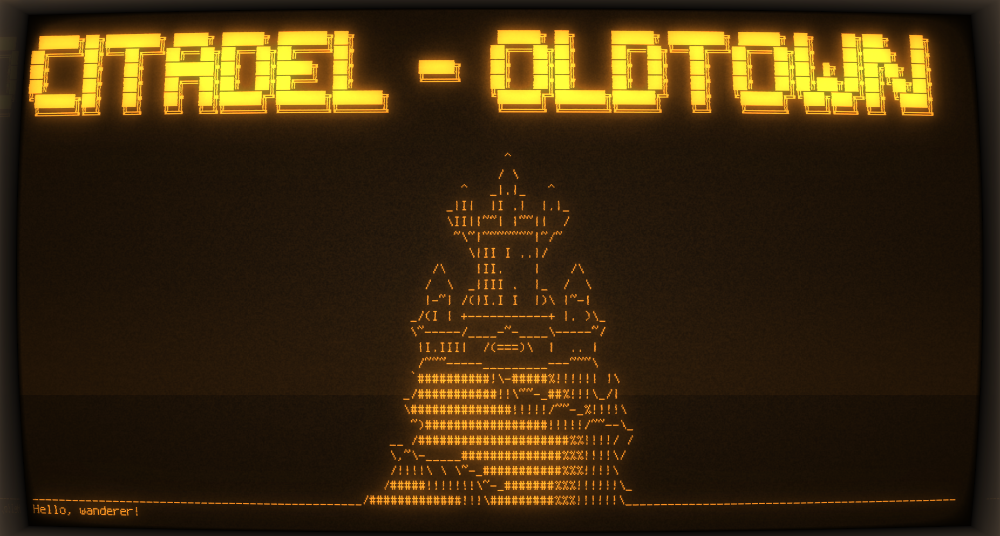

# Citadel Oldtown

**Citadel-Oldtown** is the ancient library of Westeros, and thanks to the current technologies, anyone can be a part of it. 




## Diagram


## Technical info

### Commands to run (Linux, Ubuntu)

To run the project as a .jar:
```bash
mvn clean package
java -jar target/citadel-oldtown-1.0-SNAPSHOT.jar
```

### Terminal
[cool-retro-term](https://github.com/Swordfish90/cool-retro-term)